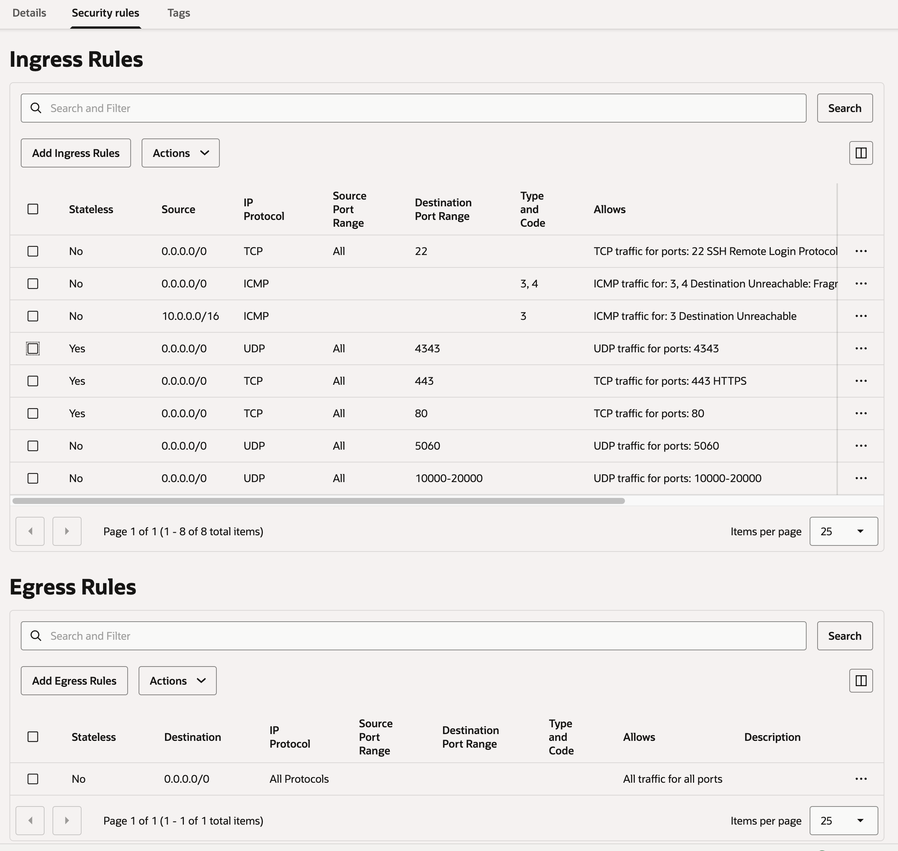

# Ubuntu PBX - Ansible Deployment

This Ansible playbook installs and configures FreePBX 17 on Ubuntu 24.04 LTS.

Original Canonical [Blog Post](https://ubuntu.com/blog/install-freepbx-and-asterisk-on-ubuntu-24-04-lts-for-security-patches-until-2036) and cloud-init [github repo](https://github.com/rajannpatel/ubuntupbx)

## Requirements

- **Target server:** Ubuntu 24.04 LTS with SSH access
- **Control machine:** Ansible 2.9+
- **Ansible collection:** `community.general`

## Tested On

Oracle Cloud AMD Always Free instance running Ubuntu 24.04 minimal. The only difficulty might be setting up appropriate ingress and egress rules; here's what our test setup looks like. 



## Quick Start

After setting up your instance, and loading your ssh key to it, log in to verify the ssh connection works. 

Then follow the commands below. 

```bash
# 1. Install the required Ansible collection (one-time)
ansible-galaxy collection install community.general

# 2. Copy template files
cp vars.yml.example vars.yml
cp inventory.yml.example inventory.yml

# 3. If you will use SMTP, create a .env file with SMTP password
# Example .env file contents:
# SMTP_PASSWORD=veryhardpassword

# 4. Add your own values to the vars and inventory
nano vars.yml      # Set timezone, email, etc.
nano inventory.yml # Set your server IP/hostname

# 4. Run the playbook
ansible-playbook -i inventory.yml playbook.yml
```

## Configuration

Edit `vars.yml` before running. Key settings:

| Variable | Description |
|----------|-------------|
| `timezone` | Server timezone (e.g., `Africa/Johannesburg`) |
| `hostname` / `fqdn` | Server identity (used by Postfix if email is configured) |
| `smtp_*` | Email relay settings (optional) |
| `enable_ufw` | Enable host firewall (recommended) |
| `sip_port` | SIP signaling port (default `5060`). Use a non-standard port to reduce scanner spam |
| `php_version` | `8.3` (default) or `8.2` |

## Useful Flags

```bash
# Dry run (show what would change)
ansible-playbook -i inventory.yml playbook.yml --check

# Verbose output
ansible-playbook -i inventory.yml playbook.yml -v

# Ask for SSH password
ansible-playbook -i inventory.yml playbook.yml --ask-pass

# Ask for sudo password
ansible-playbook -i inventory.yml playbook.yml --ask-become-pass
```

## After Installation

The web UI is blocked by the firewall by default. Access it via SSH tunnel:

```bash
ssh -L 8080:localhost:80 user@your-server
```

Then open http://localhost:8080 in your browser to:

1. Create an admin account
2. Add extensions (internal phones)
3. Optionally configure a SIP trunk for external calling

## Firewall (ufw)

When `enable_ufw: true`, the following ports are opened:

| Port | Protocol | Purpose |
|------|----------|---------|
| 22 | TCP | SSH |
| `sip_port` (default 5060) | UDP | SIP signaling |
| 10000-20000 | UDP | RTP (voice traffic) |

Port 80 (web UI) is blocked by default. Set `ufw_allow_web: true` to open it.

## Verification

A verification playbook is included to confirm the server was deployed correctly. It checks services, configuration, security, and connectivity.

```bash
# Run all automated checks (skip interactive tests)
ansible-playbook -i inventory.yml verify.yml --skip-tags manual

# Run all checks including interactive tests (SMTP delivery, SIP trunks, calling)
ansible-playbook -i inventory.yml verify.yml

# Run only the interactive tests
ansible-playbook -i inventory.yml verify.yml --tags manual
```

The automated checks verify:
- System setup (hostname, timezone, swap, asterisk user)
- Services running and enabled at boot (Apache, MariaDB, Asterisk, FreePBX, Postfix, Fail2ban)
- Package installation and PHP configuration
- Postfix SMTP relay settings
- Apache configuration (modules, rate limiting, AllowOverride)
- MariaDB databases and ODBC connectivity
- Asterisk (ownership, PJSIP, codecs, symlinks)
- FreePBX installation, modules, and T.38 settings
- Fail2ban jails and whitelist
- UFW firewall rules and external port blocking
- Log rotation and cron jobs

The manual (interactive) checks prompt the operator to confirm:
- SMTP email delivery
- SIP trunk registration
- Outbound and inbound calling
- Voicemail recording and playback

Results are shown in the Ansible play recap: `ok` = passed, `ignored` = failed.

## File Structure

```
ansible/
├── inventory.yml   # Target server(s)
├── vars.yml        # Configuration variables
├── playbook.yml    # Main playbook
├── verify.yml      # Post-deploy verification
├── templates/      # Jinja2 config templates
└── files/          # Static files (backups)
```
